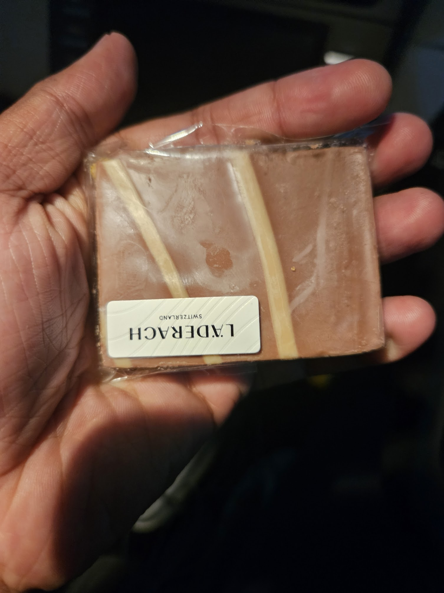

It is the last week of my sabbatical.
I pushed myself to hit swimming classes all day and spend time in the pool for 1.5 to 2 hrs.
This week at the pool was about..
1. Kicking the water holding the grill
2. Kicking the water, jumping and pushing on the breadth side of the pool. I struggled initially, but then I was able to grasp it 
3. Then we did the breathing lessons holding the grill and moving along the breadth side.
4. Last class on Friday was doing the same along the length side. 
I realised I need to work more on holding my breath for longer. 

I had to manage the gym and pool schedules. I started hitting the gym around 3.PM so that I can make it to the pool around 4.30 PM.
I didn't attend the HIIT session this week because I've started feeling it's boring, and I want to save some energy for my swimming lessons.

I need to figure out what I'm going to do once my work starts. 

Besides, I had a discussion with Abhiram about the pricing strategy of Feeable. We are working on pricing for the MVP. 

I was playing with Kiro from Amazon for specing, and it has been giving quite impressive results regarding specs. Since it's in the preview stage, I often encounter rate limits. 

I had sent a Lindt bar to Mariyam, and she said she loved it. 

Friend of mine who visited Swizz brought us [Laderach](https://laderach.com/eu-en/) chocolates. And it was one of the yummiest Artisanal chocolates I've had.

