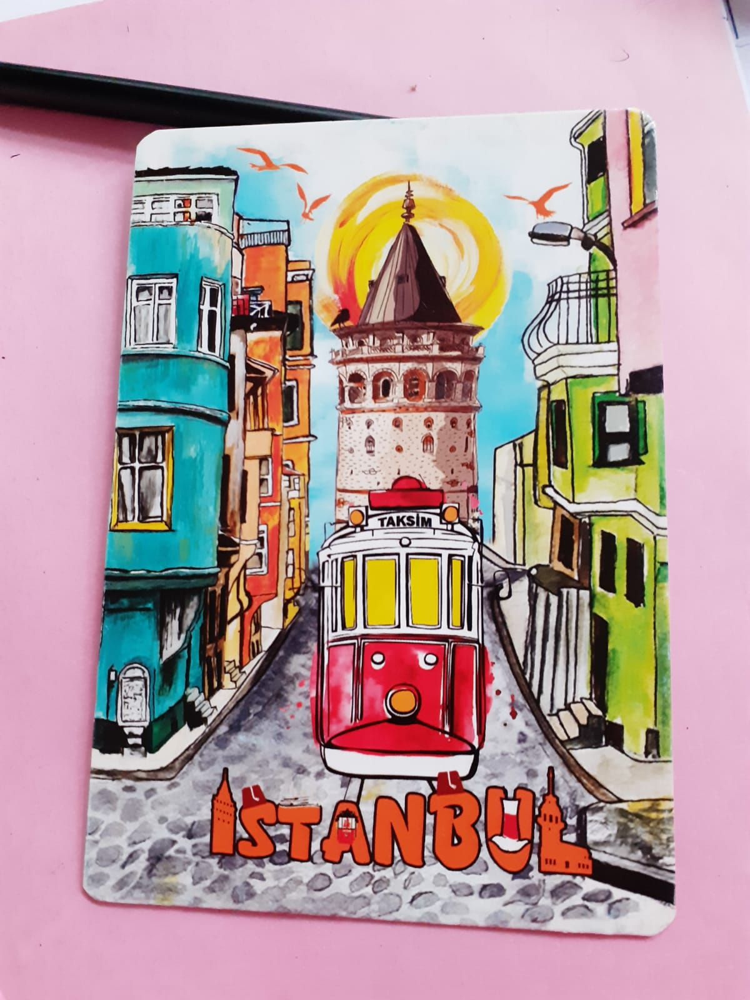

We used to write letters to our home when we travelled abroad as a souvenir.

From this time onwards, I started writing letters to my current favourite people too, from whichever cities I travelled,  to show my remembrance and bond with them.

I plan to do this more frequently and regularly. 

Some of the postcards I sent this year are..

<em>From Mittenwald and Kandel, Germany.</em>

<em>From Dubai.</em>

<em>From Prague</em>

<em>From Zupspitze, Germany.</em>

<em>From Istanbul, Turkey</em>

